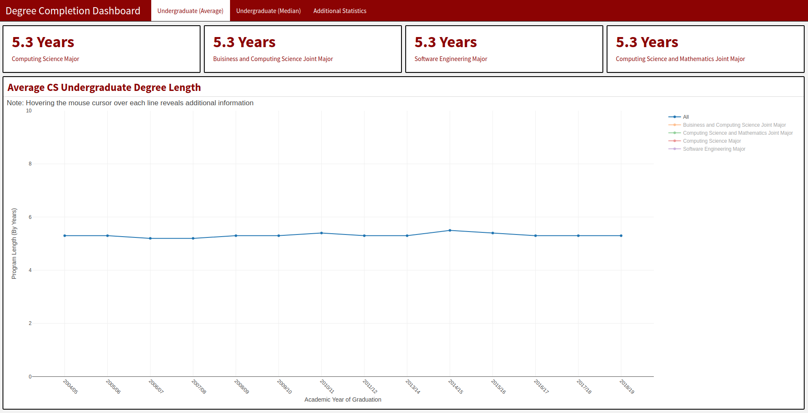

# DegreeCompletionDashBoard

## This dashboard was constructed using FlexDashboard to vizualize how long it takes students to complete a computing science degree.  Please note that this dashboard is a "dumbdowned" version of the original dashboard that contained several more tabs and contained sensitive data from real institutions.  As a result all data shown here is fake and can be generated using the script "data_generation.R".

